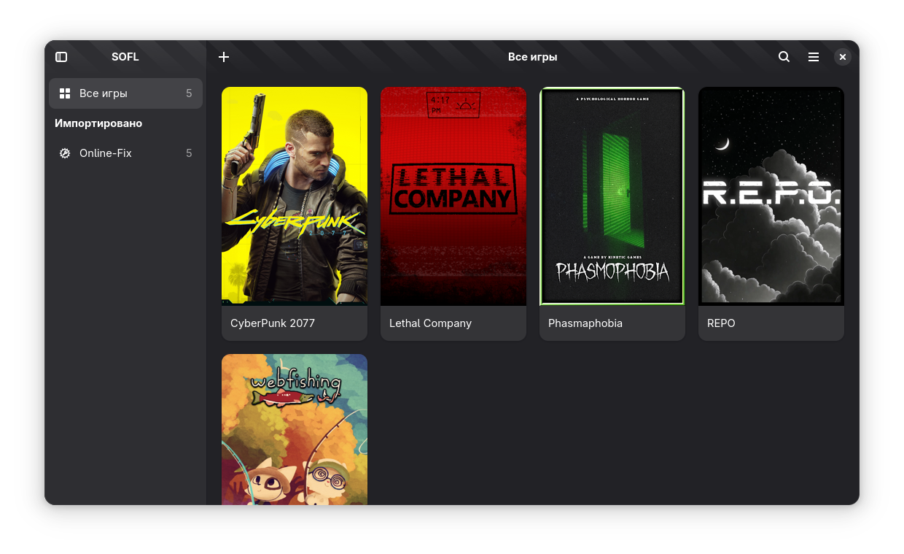
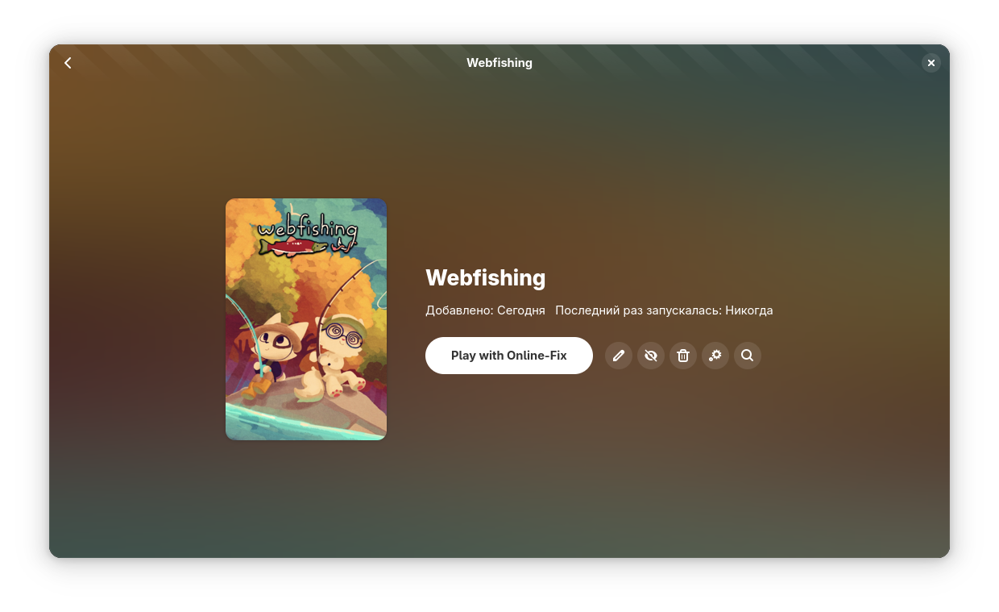

<div align="center">
  

# SOFL

## Steam Online Fix Launcher

_A launcher for games with Online-Fix support on Linux_

<p align="center">
  <a href="README_RU.md"></a>
  <a href="README.md"></a>
</p>

  <p align="center">
    <a href="https://coderabbit.ai"></a>
    <a href="https://sonarcloud.io/summary/new_code?id=BadKiko_steam-online-fix-launcher"></a>
    <a href="https://github.com/BadKiko/steam-online-fix-launcher/releases"></a>
    <a href="https://github.com/BadKiko/steam-online-fix-launcher/blob/main/LICENSE"></a>
  </p>
</div>

## 📝 About the Project

**SOFL (Steam Online Fix Launcher)** is a powerful tool for easy launching and organizing games with **online-fix** support on Linux. The application is a full-featured game library manager that solves typical problems with launching pirated games with online functionality.

The project was created to simplify the lives of Linux users who want to play modern multiplayer games without having to manually configure environments, Wine prefixes, and Proton versions.

### 🎯 Key Benefits

- **🎮 Unified library** of all your games in one place
- **🔧 Automatic problem solving** for launching online games
- **🎨 Modern interface** in GNOME style
- **🌐 Full support** for multiple gaming platforms

---

## ✨ Features

### 🎯 Core Functions

- 🚀 **Easy launch** of online games without complex settings
- 📚 **Library management** — all games in one place
- 🖼️ **Automatic covers** from SteamGridDB
- 🔄 **Support for various types** of online games
- 🔧 **Automatic fixes** for typical problems
- 🔍 **Integration with services** IGDB, ProtonDB, Lutris
- 📂 **Game import** from Steam, Heroic, Lutris, Bottles, Itch, Legendary, RetroArch

### 🎮 Online Games Support

- **Online-Fix** — specialized support for pirated games with online features

### 🌐 Integrations

- **SteamGridDB** — automatic cover downloads
- **IGDB** — game information and ratings
- **ProtonDB** — compatibility and community reviews
- **Lutris** — integration with the largest Linux gaming platform
- **Steam** — native Steam library support

---

## 📸 Screenshots

<div align="center">

### 🏠 Main Screen



### 🎮 Game Card



---

<div align="left">

## 🛠️ Installation

### 📦 From Official Repositories

#### Flatpak (recommended)

```bash
# Install from Latest Release
curl -L https://github.com/badkiko/steam-online-fix-launcher/releases/latest/download/org.badkiko.sofl.flatpak -o /tmp/sofl.flatpak && flatpak install -y /tmp/sofl.flatpak && rm /tmp/sofl.flatpak
```

### ⚙️ Basic Setup

1. **Online-Fix Games Path**: Specify the directory with your games
2. **Proton Version**: Select the appropriate Proton version
3. **Import Sources**: Enable the required gaming platforms

## 🙏 Acknowledgments

### 👥 Development Team

- **[BadKiko](https://github.com/badkiko)** — lead developer and project founder
- **[Niko-PRO](https://github.com/Niko-PRO)** — architecture and design

### 🎯 Inspiration and Thanks

A huge thank you to the [**@kra-mo/cartridges**](https://github.com/kra-mo/cartridges) project! Their excellent work has been a great inspiration and resource for our launcher.

### 🤝 Contributing

We welcome contributions from the community! Whether you're fixing bugs, adding features, improving documentation, or helping with translations, your help is appreciated.

📖 **[How to contribute](CONTRIBUTING.md)** — detailed guide for contributors

## 📜 License

This project is licensed under **GPL-3.0**. See the [LICENSE](LICENSE) file for details.

## 📊 Project Statistics

<div align="center">

### 🌟 Popularity Growth

<a href="https://www.star-history.com/#BadKiko/steam-online-fix-launcher&Date">
 <picture>
   <source media="(prefers-color-scheme: dark)" srcset="https://api.star-history.com/svg?repos=BadKiko/steam-online-fix-launcher&type=Date&theme=dark" />
   <source media="(prefers-color-scheme: light)" srcset="https://api.star-history.com/svg?repos=BadKiko/steam-online-fix-launcher&type=Date" />
   
 </picture>
</a>
</div>

---

<div align="center">

### 🎮 Join the Community!

⭐ **Star the project** if you like it!  
🐛 **Report a bug** or **suggest a feature** through [Issues](https://github.com/BadKiko/steam-online-fix-launcher/issues)

---

_SOFL — your reliable partner in the world of online games on Linux! 🚀_

</div>
