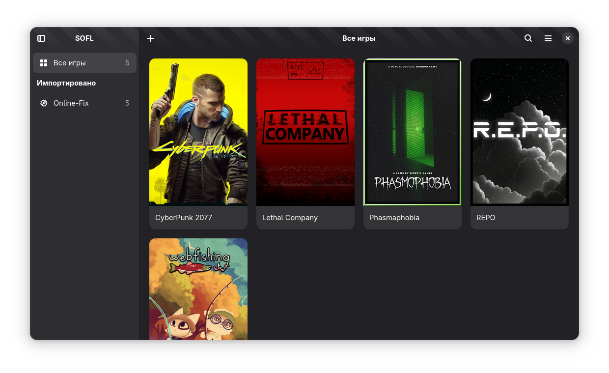
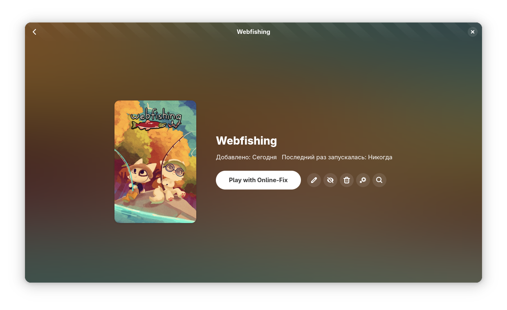

<div align="center">
  

# SOFL

## Steam Online Fix Launcher

_Лаунчер для игр с поддержкой Online-Fix на Linux_

<p align="center">
  <a href="README_RU.md"></a>
  <a href="README.md"></a>
</p>

  <p align="center">
    <a href="https://coderabbit.ai"></a>
    <a href="https://sonarcloud.io/summary/new_code?id=BadKiko_steam-online-fix-launcher"></a>
    <a href="https://github.com/BadKiko/steam-online-fix-launcher/releases"></a>
    <a href="https://github.com/BadKiko/steam-online-fix-launcher/blob/main/LICENSE"></a>
  </p>
</div>

## 📝 О проекте

**SOFL (Steam Online Fix Launcher)** — это мощный инструмент для легкого запуска и организации игр с поддержкой **online-fix** на Linux. Приложение представляет собой полнофункциональный менеджер библиотеки игр, который решает типичные проблемы с запуском игр с онлайн-функциональностью.

Проект создан для упрощения жизни пользователей Linux, которые хотят играть в современные игры с мультиплеером без необходимости вручную настраивать окружение, Wine префиксы и Proton версии.

### 🎯 Основные преимущества

- **🎮 Единая библиотека** всех ваших игр в одном месте
- **🔧 Автоматическое решение проблем** с запуском онлайн-игр
- **🎨 Современный интерфейс** в стиле GNOME
- **🌐 Полная поддержка** множества игровых платформ

---

## ✨ Возможности

### 🎯 Основные функции

- 🚀 **Простой запуск** онлайн-игр без сложных настроек
- 📚 **Управление библиотекой** — все игры в одном месте
- 🖼️ **Автоматические обложки** из SteamGridDB
- 🔄 **Поддержка различных типов** онлайн-игр
- 🔧 **Автоматическое исправление** типичных проблем
- 🔍 **Интеграция с сервисами** IGDB, ProtonDB, Lutris
- 📂 **Импорт игр** из Steam, Heroic, Lutris, Bottles, Itch, Legendary, RetroArch

### 🎮 Поддержка онлайн-игр

- **Online-Fix** — специализированная поддержка игр с онлайн-функциями

### 🌐 Интеграции

- **SteamGridDB** — автоматическая загрузка обложек
- **IGDB** — информация об играх и рейтинги
- **ProtonDB** — совместимость и отзывы сообщества
- **Lutris** — интеграция с крупнейшей игровой платформой Linux
- **Steam** — нативная поддержка Steam библиотеки

---

## 📸 Скриншоты

<div align="center">

### 🏠 Главный экран



### 🎮 Карточка игры



---

<div align="left">

## 🛠️ Установка

### 📦 Из официальных репозиториев

#### Flatpak (рекомендуется)

```bash
# Установка из Latest Release
curl -L https://github.com/badkiko/steam-online-fix-launcher/releases/latest/download/org.badkiko.sofl.flatpak -o /tmp/sofl.flatpak && flatpak install --user -y /tmp/sofl.flatpak && rm /tmp/sofl.flatpak
```

### ⚙️ Базовая настройка

1. **Путь к играм Online-Fix**: Укажите директорию с вашими играми
2. **Версия Proton**: Выберите подходящую версию Proton
3. **Источники импорта**: Включите нужные игровые платформы

## 🙏 Благодарности

### 👥 Команда разработчиков

- **[BadKiko](https://github.com/badkiko)** — ведущий разработчик и основатель проекта
- **[Niko-PRO](https://github.com/Niko-PRO)** — архитектура и дизайн

### 🎯 Вдохновение и благодарности

Огромное спасибо проекту [**@kra-mo/cartridges**](https://github.com/kra-mo/cartridges)! Их отличная работа стала большим вдохновением и ресурсом для нашего лаунчера.

### 🤝 Как внести вклад

Мы приветствуем вклад от сообщества! Независимо от того, исправляете ли вы баги, добавляете новые функции, улучшаете документацию или помогаете с переводами, ваша помощь ценна.

📖 **[Как внести вклад](CONTRIBUTING_RU.md)** — подробное руководство для контрибьюторов

## 📜 Лицензия

Этот проект лицензирован под **GPL-3.0**. Подробности смотрите в файле [LICENSE](LICENSE).

## 📊 Статистика проекта

<div align="center">

### 🌟 Рост популярности

<a href="https://star-history.dera.page/#BadKiko/steam-online-fix-launcher&type=Date">
 <picture>
   <source media="(prefers-color-scheme: dark)" srcset="https://star-history.dera.page/svg?repos=BadKiko/steam-online-fix-launcher&type=Date&theme=dark" />
   <source media="(prefers-color-scheme: light)" srcset="https://star-history.dera.page/svg?repos=BadKiko/steam-online-fix-launcher&type=Date" />
   
 </picture>
</a>
</div>

---

<div align="center">

### 🎮 Присоединяйтесь к сообществу!

⭐ **Поставьте звезду**, если проект вам понравился!  
🐛 **Сообщите о баге** или **предложите фичу** через [Issues](https://github.com/BadKiko/steam-online-fix-launcher/issues)

---

_SOFL — ваш надежный партнер в мире онлайн игр на Linux! 🚀_

</div>
